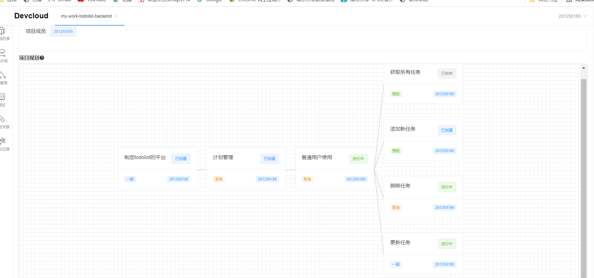

# Lab01实验报告

## 22.02.28 熊丘桓

### 项目分工

考虑到本次实验难度较低，每个小组成员都自行新建项目并完成了实验，熟悉实验平台。

| 成员姓名 | 成员学号  | 工作内容 |
| -------- | --------- | -------- |
| 熊丘桓   | 201250172 | 全部     |
| 蔡之恒   | 201250127 | 全部     |
| 王福森   | 201250185 | 全部     |
| 孙立帆   | 201250181 | 全部     |

### 需求树

### 任务列表

### 缺陷列表

### 前端流水线部署成功日志

### 前端流水线部署产物日志

### 后端流水线部署成功日志

### 后端流水线部署产物日志

### 数据库初始化执行结果

### 数据表初始化执行结果

### 数据初始化执行结果

### 黑盒测试

### 前端bug修复

### 后端bug修复

